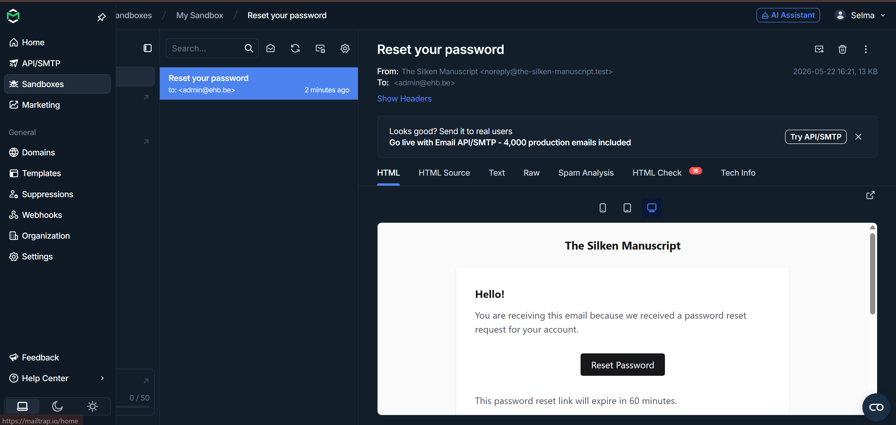

# AI-chatlog extract – The Silken Manuscript

Dit document bevat een geselecteerd overzicht van hoe ik ChatGPT heb gebruikt tijdens de ontwikkeling van mijn Laravel-project.

Ik gebruikte AI als ondersteuning bij het debuggen, het controleren van de opdrachtvereisten, het begrijpen van Laravel-structuur, het verbeteren van routes en middleware, het configureren van de lokale ontwikkelomgeving en het testen van emails via een SMTP sandbox.

Alle suggesties werden door mij nagekeken, aangepast, getest en manueel verwerkt in mijn eigen project.

---

## 1. Laravel-projectstructuur

**Student:**  
Hoe kan ik een Laravel-project structureren met publieke pagina’s, ingelogde gebruikerspagina’s en beschermde adminpagina’s?

**AI:**  
Gebruik aparte routegroepen voor publieke routes, routes voor ingelogde gebruikers en routes die enkel toegankelijk zijn voor admins. Publieke routes zijn toegankelijk voor iedereen. Profiel- en favorietenroutes gebruik je met de `auth` middleware. Adminroutes bescherm je met `auth` en een extra admin-middleware.

---

## 2. Admin middleware

**Student:**  
Hoe zorg ik ervoor dat enkel admins toegang hebben tot het admin dashboard?

**AI:**  
Maak of update een middleware die controleert of de gebruiker ingelogd is en of `is_admin` gelijk is aan `true`. Als dat niet zo is, geef je een 403-foutmelding terug. Daarna pas je deze middleware toe op de `/admin` routegroep.

---

## 3. Default admin seeder

**Student:**  
De opdracht vraagt een standaard admin met username `admin`, email `admin@ehb.be` en wachtwoord `Password!321`. Hoe zorg ik ervoor dat die bestaat na `php artisan migrate:fresh --seed`?

**AI:**  
Voeg de standaard admin toe in `DatabaseSeeder.php` met de vereiste gegevens. Zorg ervoor dat `is_admin` op `true` staat en dat het wachtwoord correct wordt opgeslagen via Laravel’s password hashing.

---

## 4. Publieke profielpagina

**Student:**  
Hoe kan ik een publieke profielpagina maken die bezoekers kunnen bekijken zonder ingelogd te zijn?

**AI:**  
Maak een publieke route zoals `/readers/{user}` die verwijst naar een methode in een controller. Die methode laadt de gekozen gebruiker en toont een publieke profielview. Deze route mag niet in de `auth` middlewaregroep staan.

---

## 5. Profielgegevens aanpassen

**Student:**  
Hoe kan een ingelogde gebruiker zijn profielgegevens aanpassen, zoals biografie, verjaardag en profielfoto?

**AI:**  
Maak een update-methode in `ProfileController`. Valideer de velden, sla de profielfoto op in de publieke storage en update daarna de velden `bio`, `birthday` en `profile_picture` van de ingelogde gebruiker.

---

## 6. Favorietensysteem

**Student:**  
Hoe kan ik een favorietensysteem maken tussen gebruikers en boeken?

**AI:**  
Gebruik een many-to-many relatie tussen `User` en `Book` met een tussentabel, bijvoorbeeld `favorites`. In het `User` model definieer je een `belongsToMany(Book::class, 'favorites')` relatie. Daarna kan je via een controller een boek toevoegen of verwijderen uit de favorieten van de ingelogde gebruiker.

---

## 7. News / Chronicles beheer

**Student:**  
Hoe kan ik ervoor zorgen dat chronicles enkel door admins aangepast kunnen worden, terwijl bezoekers ze alleen kunnen lezen?

**AI:**  
Maak publieke routes voor het overzicht en de detailpagina van news items. Plaats de routes voor create, store, edit, update en delete binnen de admin routegroep. Zo kunnen bezoekers de chronicles lezen, maar enkel admins kunnen ze beheren.

---

## 8. One-to-many relatie

**Student:**  
De opdracht vraagt minstens één one-to-many relatie. Welke relatie is logisch binnen mijn project?

**AI:**  
Een goede optie is `User hasMany News` en `News belongsTo User`. Elke chronicle kan zo een auteur hebben, meestal de admin die ze publiceerde. Voeg een `user_id` foreign key toe aan de `news` tabel en definieer de relatie in beide models.

---

## 9. FAQ-pagina

**Student:**  
Hoe kan ik een FAQ-pagina maken waarbij vragen gegroepeerd worden per categorie?

**AI:**  
Sla elke FAQ op met een `category`, `question` en `answer`. In de publieke FAQ-controller groepeer je de FAQ-items per categorie voordat je ze naar de view stuurt. Admins kunnen FAQ-items beheren via CRUD-routes.

---

## 10. Contactformulier

**Student:**  
Hoe kan ik een contactformulier maken en ervoor zorgen dat admins de ingezonden berichten kunnen bekijken?

**AI:**  
Maak een `ContactMessage` model en migration. Het publieke formulier slaat berichten op in de database en verstuurt een email naar de admin. In het admin dashboard kan je een beschermde pagina voorzien waar admins berichten kunnen bekijken, markeren als gelezen of verwijderen.

---

## 11. Routes opschonen

**Student:**  
Mijn routes gebruiken nog enkele closure functions. De opdracht zegt dat alle routes controller methods moeten gebruiken. Hoe los ik dat op?

**AI:**  
Verplaats eenvoudige `return view(...)` logica naar methodes in controllers. Bijvoorbeeld: in plaats van een closure voor `/rules`, maak je een `rules()` methode in `PageController` en verwijs je in de route naar `[PageController::class, 'rules']`.

---

## 12. Guest-, user- en adminrechten testen

**Student:**  
Welke URLs moet ik testen om zeker te zijn dat de rechten goed werken?

**AI:**  
Test publieke pagina’s terwijl je uitgelogd bent: `/index`, `/rules`, `/faq`, `/contact`, `/chronicles`.  
Test daarna beschermde gebruikerspagina’s zoals `/profile` terwijl je uitgelogd en ingelogd bent.  
Test ten slotte `/admin/dashboard` als admin en als gewone gebruiker, zodat je zeker bent dat gewone gebruikers geen toegang krijgen tot adminpagina’s.

---

## 13. Seeders testen

**Student:**  
Hoe kan ik controleren of mijn database seeders correct werken?

**AI:**  
Run `php artisan migrate:fresh --seed` en gebruik daarna Tinker om aantallen te controleren, zoals `User::count()`, `Book::count()`, `Faq::count()` en `News::count()`. Test ook of het standaard adminaccount kan inloggen.

---

## 14. README plannen

**Student:**  
Wat moet ik opnemen in mijn README voor dit Laravel-project?

**AI:**  
Neem een projectbeschrijving op, de belangrijkste functionaliteiten, installatie-instructies, testaccounts, technische vereisten met verwijzing naar de bestanden waar ze geïmplementeerd zijn, screenshots, gebruikte bronnen en een samenvatting van het AI-gebruik.

---

## 15. Laravel Herd en APP_URL

**Student:**  
Ik open mijn Laravel-project niet via `localhost`, maar via Laravel Herd met de URL `http://the-silken-manuscript.test`. Wat moet ik aanpassen?

**AI:**  
Omdat het project via Laravel Herd geopend wordt, moet `APP_URL` in het `.env`-bestand overeenkomen met de Herd-URL. De lokale map `C:\Users\Salma\Herd\The-Silken-Manuscript` is enkel de plaats waar het project op de computer staat. De URL van de applicatie is:

```env
APP_URL=http://the-silken-manuscript.test
```

Na het aanpassen van `.env` moet de Laravel-configuratiecache leeggemaakt worden met:

```bash
php artisan optimize:clear
```

---

## 16. Projectnaam aanpassen in `.env`

**Student:**  
Mijn `.env` gebruikt nog `APP_NAME=Laravel`. Moet ik dat aanpassen?

**AI:**  
Ja. Voor een afgewerkt project is het beter dat de applicatienaam overeenkomt met de naam van het project. Daarom kan `APP_NAME` aangepast worden naar:

```env
APP_NAME="The Silken Manuscript"
```

Hierdoor wordt de juiste projectnaam gebruikt in onderdelen zoals emails, notificaties en configuratie waar `${APP_NAME}` gebruikt wordt.

---

## 17. Password reset mail testen

**Student:**  
De docent zei dat het een extra pluspunt zou zijn als ik het verzenden van een mail echt kan simuleren wanneer iemand “wachtwoord vergeten” gebruikt. Hoe kan ik dat doen?

**AI:**  
In plaats van `MAIL_MAILER=log`, waarbij emails alleen in `storage/logs/laravel.log` komen, kan je een SMTP testing service gebruiken zoals Mailtrap. Daarmee worden emails niet echt naar externe gebruikers verzonden, maar opgevangen in een sandbox inbox. Zo kan je visueel controleren of de password reset mail correct aankomt.

---

## 18. Mailtrap configureren

**Student:**  
Welke mailconfiguratie moet ik in mijn `.env` zetten voor Mailtrap?

**AI:**  
Gebruik de SMTP-gegevens die Mailtrap geeft in de sandbox inbox. De configuratie ziet er bijvoorbeeld zo uit:

```env
MAIL_MAILER=smtp
MAIL_HOST=sandbox.smtp.mailtrap.io
MAIL_PORT=2525
MAIL_USERNAME=your_mailtrap_username
MAIL_PASSWORD=your_mailtrap_password
MAIL_FROM_ADDRESS="noreply@the-silken-manuscript.test"
MAIL_FROM_NAME="${APP_NAME}"
```

Na het aanpassen van de mailconfiguratie moet opnieuw de configuratiecache leeggemaakt worden:

```bash
php artisan optimize:clear
```

Daarna kan je de password reset flow testen door naar “Forgot password” te gaan, het emailadres van een bestaande gebruiker in te vullen en te controleren of de email verschijnt in de Mailtrap sandbox inbox.

---

## 19. Screenshot van Mailtrap toevoegen

**Student:**  
Ik heb een screenshot toegevoegd van de password reset mail in Mailtrap. Hoe vermeld ik dat in mijn README?

**AI:**  
Voeg het screenshot toe aan de map `docs/screenshots` en vermeld het bij de screenshots in de README. Bijvoorbeeld:

```md

```

Dit toont aan dat de password reset mail effectief werd gesimuleerd en visueel gecontroleerd in een test inbox.

---

## 20. README aanpassen aan Herd en Mailtrap

**Student:**  
Mijn README vermeldt nog oude lokale serverinformatie. Hoe pas ik dit aan?

**AI:**  
Vervang de oude instructies rond `localhost` of `php artisan serve` door uitleg over Laravel Herd. Vermeld ook dat Mailtrap gebruikt werd voor lokale emailtesting. Voeg bij de extra features toe dat password reset mails getest werden via een SMTP sandbox en dat het `.env`-bestand niet mee gecommit wordt omdat het lokale configuratiegegevens bevat.

---

## Reflectie over AI-gebruik

ChatGPT werd gebruikt als ondersteunend hulpmiddel tijdens de ontwikkeling. Ik gebruikte het vooral om Laravel-concepten beter te begrijpen, fouten te debuggen, te controleren of mijn project overeenkwam met de opdrachtcriteria en om de structuur van routes, seeders, middleware, README en mailconfiguratie te verbeteren.

Daarnaast werd ChatGPT gebruikt om de lokale ontwikkelomgeving met Laravel Herd correct te documenteren en om Mailtrap te integreren als SMTP sandbox voor het testen van password reset emails.

Ik heb de suggesties zelf getest, aangepast en manueel verwerkt in mijn project. De uiteindelijke code, configuratie en documentatie werden door mij gecontroleerd voor ze in het project werden opgenomen.