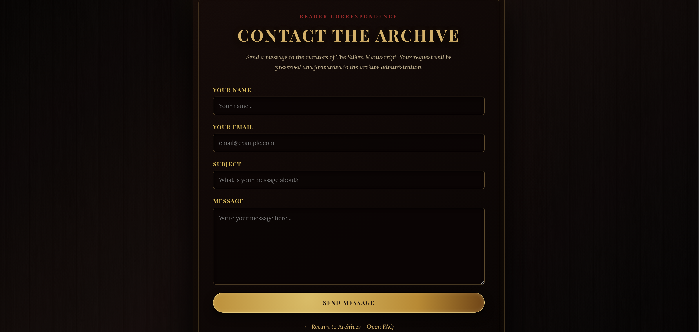
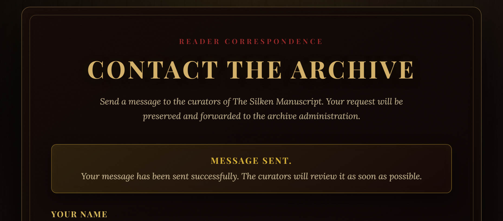
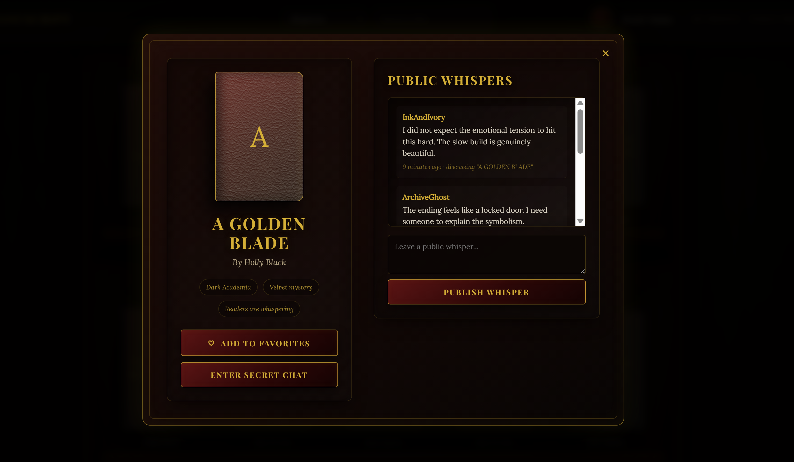
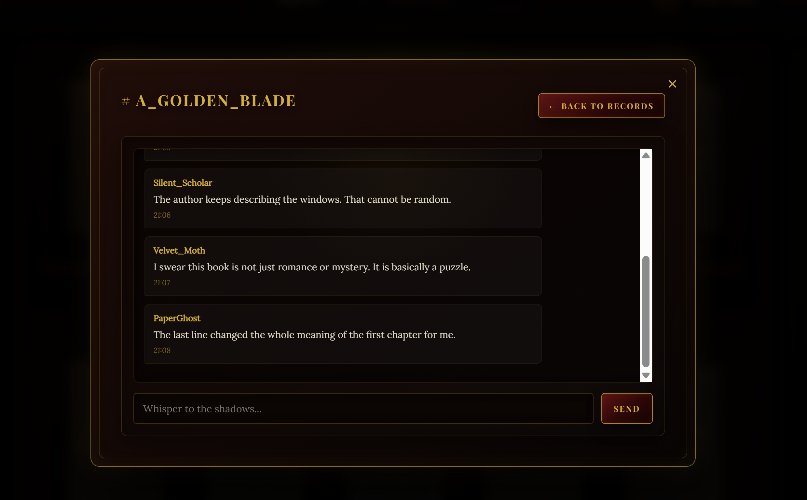

# The Silken Manuscript

## Projectbeschrijving

**The Silken Manuscript** is een dynamische Laravel-webapplicatie gebouwd voor de eindopdracht van **Backend Web**.

Het project is uitgewerkt als een fictief dark-academia archief waar bezoekers boeken kunnen ontdekken, chronicles kunnen lezen, FAQ’s kunnen raadplegen en contact kunnen opnemen. Ingelogde gebruikers kunnen hun eigen profiel beheren en boeken als favoriet bewaren. Admins krijgen toegang tot een afgeschermde beheeromgeving waar zij gebruikers, chronicles, FAQ’s, boeken en contactberichten kunnen beheren.

De applicatie gebruikt Laravel volgens het MVC-principe met controllers, Eloquent models, migrations, seeders, middleware, Blade views en authentication via Laravel Breeze.

---

## Thema

Het gekozen thema is een stijlvolle digitale bibliotheek / archiefwebsite met de naam **The Silken Manuscript**.  
Het visuele concept is gebaseerd op een koninklijk manuscript, dark academia, oude boeken, chronicles en een administratieve “Command Chamber”.

---

## Testaccounts

Na het uitvoeren van:

```bash
php artisan migrate:fresh --seed
```

zijn de volgende testaccounts beschikbaar:

### Default admin account

```txt
Username: admin
Email: admin@ehb.be
Password: Password!321
```

### Extra admin testaccount

```txt
Username: SilkenCurator
Email: salma@test.com
Password: Password!321
```

### Gewone testgebruiker

```txt
Username: VelvetReader
Email: reader@test.com
Password: Password!321
```

---

## Installatiehandleiding

### 1. Repository clonen

```bash
git clone <repository-url>
cd The-Silken-Manuscript
```

### 2. Dependencies installeren

```bash
composer install
npm install
```

### 3. Environment bestand aanmaken

Kopieer `.env.example` naar `.env`.

Linux / Mac:

```bash
cp .env.example .env
```

Windows kan dit ook manueel via de Verkenner of VS Code.

### 4. Applicatiesleutel genereren

```bash
php artisan key:generate
```

### 5. Database configureren

Pas de databasegegevens aan in `.env`.

De docent kan zijn eigen `.env` gebruiken om verbinding te maken met de database.

### 6. Migraties en seeders uitvoeren

```bash
php artisan migrate:fresh --seed
```

Hierdoor worden alle tabellen opnieuw aangemaakt en worden basisdata toegevoegd, waaronder het verplichte adminaccount, testgebruikers, boeken, FAQ-items en chronicles.

### 7. Storage link maken

Voor geüploade afbeeldingen:

```bash
php artisan storage:link
```

### 8. Development server starten

Standaard:

```bash
php artisan serve
```

Indien `php artisan serve` lokaal problemen geeft, kan de ingebouwde PHP-server gebruikt worden:

```bash
php -S 127.0.0.1:61234 -t public
```

Open daarna:

```txt
http://127.0.0.1:61234
```

### 9. Frontend assets starten

In een tweede terminal:

```bash
npm run dev
```

---

## Belangrijkste functionaliteiten

### Publieke functionaliteiten

- Landing page
- Archiefpagina met boeken
- Boeken filteren op titel en genre
- Chronicles overzicht
- Chronicle detailpagina
- FAQ-pagina gegroepeerd per categorie
- Rules-pagina
- Contactformulier
- Publieke profielpagina’s van gebruikers

### Functionaliteiten voor ingelogde gebruikers

- Registreren
- Inloggen en uitloggen
- Remember me
- Wachtwoord resetten
- Profiel aanpassen
- Username, verjaardag, bio en profielfoto beheren
- Boeken als favoriet bewaren
- Eigen profiel bekijken

### Adminfunctionaliteiten

- Afgeschermd admin dashboard
- Gebruikers manueel aanmaken
- Gebruikers promoveren tot admin
- Adminrechten afnemen
- Chronicles aanmaken, aanpassen en verwijderen
- FAQ-items aanmaken, aanpassen en verwijderen
- Boeken toevoegen aan het archief
- Contactberichten bekijken
- Contactberichten markeren als gelezen
- Contactberichten verwijderen

---

## Belangrijke routes

### Publieke routes

| Route | Beschrijving | Bestand |
|---|---|---|
| `/` | Landing page | `routes/web.php`, lijn 14 |
| `/index` | Archiefpagina | `routes/web.php`, lijn 15 |
| `/rules` | Rules-pagina | `routes/web.php`, lijn 16 |
| `/faq` | FAQ-pagina | `routes/web.php`, lijn 18 |
| `/contact` | Contactformulier | `routes/web.php`, lijnen 20-21 |
| `/readers/{user}` | Publiek profiel | `routes/web.php`, lijn 23 |
| `/chronicles` | Chronicles overzicht | `routes/web.php`, lijn 26 |
| `/chronicles/{news}` | Chronicle detailpagina | `routes/web.php`, lijn 27 |

### Authenticated routes

| Route | Beschrijving | Bestand |
|---|---|---|
| `/profile` | Profiel aanpassen | `routes/web.php`, lijn 31 |
| `/profile/update` | Profiel opslaan | `routes/web.php`, lijn 32 |
| `/my-profile` | Eigen profielpagina | `routes/web.php`, lijn 34 |
| `/books/{book}/toggle-favorite` | Favoriet togglen | `routes/web.php`, lijnen 36-37 |

### Admin routes

| Route | Beschrijving | Bestand |
|---|---|---|
| `/admin/dashboard` | Admin dashboard | `routes/web.php`, lijn 47 |
| `/admin/books/create` | Boek toevoegen | `routes/web.php`, lijn 50 |
| `/admin/news/create` | Chronicle aanmaken | `routes/web.php`, lijn 54 |
| `/admin/news/{news}/edit` | Chronicle aanpassen | `routes/web.php`, lijn 56 |
| `/admin/users/{user}/toggle` | Adminrechten wijzigen | `routes/web.php`, lijn 61 |
| `/admin/users/create` | User manueel aanmaken | `routes/web.php`, lijn 62 |
| `/admin/faqs/create` | FAQ aanmaken | `routes/web.php`, lijn 65 |
| `/admin/contact-messages` | Contactberichten bekijken | `routes/web.php`, lijn 72 |

---

## Technische vereisten en implementatie

### 1. Login systeem

| Vereiste | Implementatie |
|---|---|
| Bezoekers kunnen inloggen | Laravel Breeze auth routes in `routes/auth.php` |
| Bezoekers kunnen registreren | `app/Http/Controllers/Auth/RegisteredUserController.php` |
| Useraccount is gewone gebruiker of admin | `app/Models/User.php`, lijnen 12-21 en 31-38 |
| Admin kan gebruikers promoveren/degraderen | `app/Http/Controllers/AdminController.php`, lijnen 18-28 |
| Admin kan gebruikers manueel aanmaken | `app/Http/Controllers/AdminController.php`, lijnen 30-53 |
| Adminroutes zijn afgeschermd | `routes/web.php`, lijnen 41-44 |
| Custom admin middleware | `app/Http/Middleware/EnsureUserIsAdmin.php`, lijnen 11-18 |
| Default admin in database | `database/seeders/DatabaseSeeder.php`, lijnen 20-28 |

---

### 2. Profielpagina

| Vereiste | Implementatie |
|---|---|
| Publieke profielpagina | `routes/web.php`, lijn 23 |
| Publiek profiel tonen | `app/Http/Controllers/ProfileController.php`, lijnen 95-100 |
| Ingelogde gebruiker kan profiel aanpassen | `app/Http/Controllers/ProfileController.php`, lijnen 43-68 |
| Username | `app/Models/User.php`, lijn 16 |
| Verjaardag | `app/Models/User.php`, lijn 17 en `ProfileController.php`, lijnen 47 en 64 |
| Profielfoto | `ProfileController.php`, lijnen 48 en 53-60 |
| Bio / over mij | `app/Models/User.php`, lijn 18 en `ProfileController.php`, lijn 63 |

---

### 3. Laatste nieuwtjes / Chronicles

| Vereiste | Implementatie |
|---|---|
| Bezoekers zien lijst van chronicles | `routes/web.php`, lijn 26 |
| Bezoekers zien detailpagina | `routes/web.php`, lijn 27 |
| Admin kan chronicles toevoegen | `routes/web.php`, lijnen 54-55 |
| Admin kan chronicles aanpassen | `routes/web.php`, lijnen 56-57 |
| Admin kan chronicles verwijderen | `routes/web.php`, lijn 58 |
| Titel/content/afbeelding/publicatiedatum | `app/Models/News.php`, lijnen 9-19 |
| Afbeelding opslaan | `app/Http/Controllers/NewsController.php`, lijnen 36-40 en 68-74 |
| Chronicle koppelen aan admin/auteur | `NewsController.php`, lijn 43 |
| Publicatiedatum instellen | `NewsController.php`, lijn 47 |

---

### 4. FAQ-pagina

| Vereiste | Implementatie |
|---|---|
| FAQ publiek zichtbaar | `routes/web.php`, lijn 18 |
| Vragen gegroepeerd per categorie | `app/Http/Controllers/FaqController.php`, lijnen 10-18 |
| Admin kan FAQ toevoegen | `routes/web.php`, lijnen 65-66 |
| Admin kan FAQ aanpassen | `routes/web.php`, lijnen 67-68 |
| Admin kan FAQ verwijderen | `routes/web.php`, lijn 69 |
| FAQ model | `app/Models/Faq.php`, lijnen 7-13 |

De FAQ gebruikt een `category` veld in de `faqs` tabel. Hierdoor kunnen vragen per categorie gegroepeerd worden op de publieke FAQ-pagina.

---

### 5. Contactpagina

| Vereiste | Implementatie |
|---|---|
| Bezoeker kan contactformulier invullen | `routes/web.php`, lijnen 20-21 |
| Contactbericht wordt opgeslagen | `app/Http/Controllers/ContactController.php`, lijnen 16-25 |
| Admin krijgt email | `ContactController.php`, lijnen 27-38 |
| Admin kan berichten bekijken | `ContactController.php`, lijnen 45-50 |
| Admin kan bericht markeren als gelezen | `ContactController.php`, lijnen 52-60 |
| Admin kan bericht verwijderen | `ContactController.php`, lijnen 63-69 |
| ContactMessage model | `app/Models/ContactMessage.php`, lijnen 7-19 |

**Opmerking:** In lokale ontwikkeling kan email getest worden met `MAIL_MAILER=log`. De inhoud van de mail wordt dan geschreven naar `storage/logs/laravel.log`.

---

### 6. Views, layouts en componenten

| Vereiste | Implementatie |
|---|---|
| Minstens twee layouts | `resources/views/layouts/app.blade.php` en `resources/views/layouts/guest.blade.php` |
| Componenten | Breeze componenten in `resources/views/components` |
| Blade control structures | `@auth`, `@guest`, `@if`, `@foreach`, `@forelse` in meerdere views |
| CSRF protection | Formulieren gebruiken `@csrf` |
| XSS protection | Blade output gebruikt `{{ }}` escaping |
| Client-side validation | HTML attributes zoals `required`, `type="email"`, `type="date"` |

Sommige hoofdviews zijn bewust als volledige Blade-pagina’s opgebouwd om de sterke visuele identiteit van het project te behouden. De standaard Breeze-layouts en componenten blijven aanwezig en worden gebruikt binnen de authentication-structuur.

---

### 7. Controllers

| Controller | Verantwoordelijkheid |
|---|---|
| `PageController` | Landing page, archief, rules en boeken toevoegen |
| `ProfileController` | Profiel aanpassen en publieke profielen tonen |
| `AdminController` | Dashboard, users aanmaken en adminrechten beheren |
| `NewsController` | Chronicles CRUD |
| `FaqController` | FAQ CRUD en publieke FAQ |
| `ContactController` | Contactformulier en admin contactberichten |
| `FavoriteController` | Favorieten togglen |

---

### 8. Models en relaties

| Relatie | Implementatie |
|---|---|
| One-to-many: User has many News | `app/Models/User.php`, lijnen 46-49 |
| One-to-many: News belongs to User | `app/Models/News.php`, lijnen 21-24 |
| Many-to-many: User favorites Books | `app/Models/User.php`, lijnen 41-44 |
| Many-to-many: Book favorited by Users | `app/Models/Book.php`, lijnen 18-21 |

---

### 9. Database en seeders

| Vereiste | Implementatie |
|---|---|
| Werkende migrations | `database/migrations` |
| Default admin | `database/seeders/DatabaseSeeder.php`, lijnen 20-28 |
| Extra testaccounts | `DatabaseSeeder.php`, lijnen 30-48 |
| Boeken basisdata | `database/seeders/BookSeeder.php`, lijnen 10-88 |
| FAQ basisdata | `DatabaseSeeder.php`, lijnen 66-88 |
| News basisdata | `DatabaseSeeder.php`, lijnen 96-115 |
| News gekoppeld aan admin | `DatabaseSeeder.php`, lijnen 96-115 |

Het project werd getest met:

```bash
php artisan migrate:fresh --seed
```

---

### 10. Security

| Vereiste | Implementatie |
|---|---|
| CSRF protection | Alle POST/PUT/DELETE formulieren gebruiken `@csrf` |
| XSS protection | Blade escaping via `{{ }}` |
| Admin protection | `EnsureUserIsAdmin.php`, lijnen 11-18 |
| Validatie | Controllers gebruiken `$request->validate()` |
| Wachtwoord hashing | `app/Models/User.php`, lijn 35 |
| Role casting | `app/Models/User.php`, lijn 37 |
| Auth middleware | `routes/web.php`, lijnen 30-38 |
| Admin middleware | `routes/web.php`, lijnen 41-44 |

---

## Extra features

Naast de basisvereisten bevat dit project ook extra functionaliteiten:

- Admin dashboard voor contactberichten
- Favorietensysteem voor boeken
- Publieke lezersprofielen
- Admin user management
- Role-based access control
- Rules-pagina
- AI-chatlog documentatie
- Sterk uitgewerkt visueel thema
- Modale adminacties in het dashboard

---

## Screenshots

De screenshots bevinden zich in:

```txt
docs/screenshots
```

Voorbeelden:











---

## Gebruikte bronnen en AI-gebruik

Tijdens de ontwikkeling van dit project gebruikte ik de volgende bronnen en hulpmiddelen:

- Laravel documentatie
- Laravel Breeze authentication scaffolding
- Google Fonts
- Transparent Textures
- ChatGPT, gebruikt als ondersteuning bij debugging, Laravel-structuur, routeorganisatie, middlewarecontrole en projectreview

De geselecteerde AI-chatlog is hier terug te vinden:

[AI_CHATLOG.md](AI_CHATLOG.md)

---

## AI-gebruik

ChatGPT werd gebruikt als ondersteunend hulpmiddel tijdens het ontwikkelingsproces. De AI werd gebruikt om Laravel-concepten beter te begrijpen, fouten te debuggen, de structuur van routes en controllers te verbeteren, middleware te controleren en de projectvereisten af te toetsen.

Alle suggesties werden manueel nagekeken, aangepast en getest voor ze in het project werden verwerkt.

---

## GitHub commits

Het project werd incrementeel ontwikkeld met meerdere commits per onderdeel en per dag. De commitgeschiedenis toont de opbouw van onder andere:

- authenticatie
- register en login views
- archiefinterface
- profielpagina’s
- favorietensysteem
- admin dashboard
- chronicles/news CRUD
- FAQ CRUD
- contactformulier
- seeders
- technische cleanup
- README en AI-chatlog

---

## Bekende opmerkingen

- Voor lokale emailtests kan `MAIL_MAILER=log` gebruikt worden.
- De applicatie gebruikt een sterk visueel thema.
- Sommige views zijn als volledige Blade-pagina’s opgebouwd om de visuele identiteit te behouden.
- De standaard Laravel Breeze-layouts en componenten blijven aanwezig voor authentication-gerelateerde functionaliteiten.
